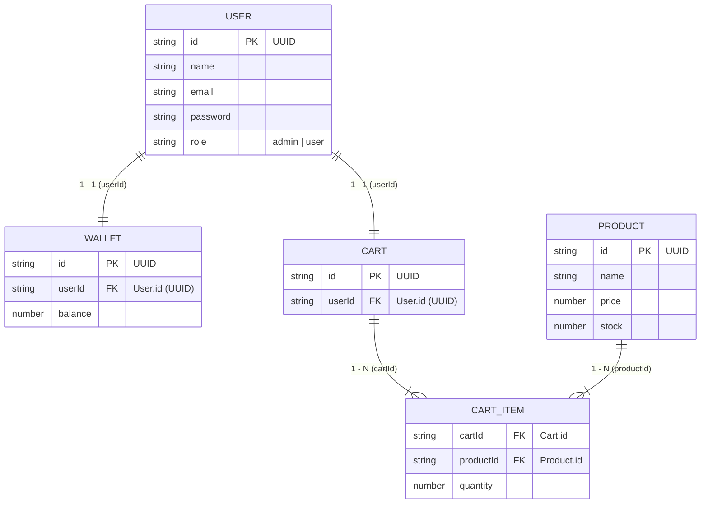

# Hướng Dẫn Phát Triển Cho AI Agent (AGENTS.md)

Tài liệu này định nghĩa kiến trúc, cấu trúc thư mục, quy tắc lập trình hướng đối tượng (OOP) và các ràng buộc khi phát triển dự án **Mini Store OOP**.

---

## 1. Tổng Quan Kiến Trúc Dự Án

Dự án áp dụng mô hình phân lớp chuẩn OOP (3-Tier Architecture) sử dụng **Node.js + TypeScript** (chế độ `strict: true`):

```
mini-store-oop/
├── data/                       # Dữ liệu dạng file JSON (Relational file storage)
│   ├── users.json              # Danh sách User (PK: id)
│   ├── wallets.json            # Ví tiền (PK: id, FK: userId -> User.id)
│   ├── products.json           # Sản phẩm (PK: id)
│   ├── carts.json              # Giỏ hàng (PK: id, FK: userId -> User.id)
│   └── cartitem.json           # Chi tiết mục giỏ hàng (FK: cartId -> Cart.id, FK: productId -> Product.id)
├── src/
│   ├── model/                  # Domain Model Entities (OOP Encapsulation)
│   ├── interfaces/             # Contracts (Abstraction)
│   ├── repositories/           # Data Access Layer (I/O file JSON, rehydration)
│   ├── services/               # Business Logic Layer (Authorization, Validation)
│   └── index.ts                # Application Entry Point
├── package.json
├── tsconfig.json
└── AGENTS.md
```

---

## 2. Sơ Đồ Quan Hệ Dữ Liệu (ERD)



---

## 3. Quy Tắc & Ràng Buộc Dành Cho Agent (Strict Rules)

### 3.1. Phân Lớp Model (`src/model/`)
- **Kế thừa Thực thể (Inheritance)**: Các entity có ID kế thừa từ lớp cha trừu tượng `BaseEntity` (`src/model/base.entity.ts`).
- **KHÔNG THÊM BẤT KỲ CLASS MODEL MỚI NÀO NGOÀI BASEENTITY**: Giữ nguyên 5 model hiện có:
  - `User` (`src/model/user.class.ts`) - kế thừa `BaseEntity`
  - `Product` (`src/model/product.class.ts`) - kế thừa `BaseEntity`
  - `Cart` (`src/model/cart.class.ts`) - kế thừa `BaseEntity`
  - `CartItem` (`src/model/cartItem.class.ts`)
  - `Wallet` (`src/model/wallet.class.ts`) - kế thừa `BaseEntity`
- **Encapsulation & Validation (Đóng gói & Ràng buộc bất biến)**:
  - Các thuộc tính nhạy cảm đặt `private` hoặc `readonly`, truy xuất và thay đổi qua getters/setters và domain methods (`increaseStock`, `decreaseStock`, `getBalance`, `deposit`, `withdraw`, `addItem`, `removeItem`, etc.).
  - **Quy tắc kiểm tra hợp lệ (Invariants)**:
    - `User`: ID và Name không rỗng; Email đúng định dạng regex; Password tối thiểu 6 ký tự; Role chỉ nhận `"admin" | "user"`.
    - `Product`: ID và Name không rỗng; Price > 0; Stock là số nguyên >= 0; `increaseStock`/`decreaseStock` chỉ nhận số nguyên > 0; không được trừ quá số tồn kho.
    - `Wallet`: ID và UserID không rỗng; Balance >= 0; getBalance và setBalance (balance >= 0).
    - `CartItem`: CartID và ProductID không rỗng; Quantity là số nguyên > 0.
    - `Cart`: ID và UserID không rỗng; Items là mảng `CartItem[]`; hỗ trợ các domain methods `addItem`, `removeItem`, `getTotalQuantity`.

### 3.2. Phân Lớp Interface (`src/interfaces/`)
- Tuân thủ các interface hợp đồng đã định nghĩa:
  - `IRepository<T>`: CRUD bất đồng bộ (`create`, `readAll`, `read`, `update`, `delete`).
  - `IService<T>`: Kết hợp `IMustBePublic<T>` và `IMustAuthorization<T>`.
  - `ISpecialService<T>`: Các nghiệp vụ đặc thù (ví dụ `AuthService.login`).

### 3.3. Phân Lớp Repository (`src/repositories/`)
- **QUY TẮC REHYDRATION (BẮT BUỘC)**:
  - Khi đọc file JSON bằng `JSON.parse()`, dữ liệu trả về chỉ là plain object.
  - **Phải luôn ánh xạ (map) sang instance class tương ứng** (`new User(...)`, `new Product(...)`, `new Wallet(...)`, `new CartItem(...)`, `new Cart(...)`) để các phương thức OOP bên trong class có thể hoạt động mà không bị lỗi `TypeError: ... is not a function`.
- **QUY TẮC GHI FILE JSON**:
  - Không sử dụng `appendFile` để nối chuỗi JSON trực tiếp (sẽ phá hỏng cú pháp mảng `[ ... ]`).
  - Quy trình chuẩn: Đọc toàn bộ mảng hiện có -> cập nhật/thêm phần tử trong bộ nhớ -> ghi đè toàn bộ mảng bằng `writeFile(path, JSON.stringify(data, null, 2))`.
  - Đảm bảo đường dẫn file tồn tại hoặc tự động tạo nếu chưa có.
- **TÍCH HỢP QUAN HỆ CART & CARTITEM**:
  - `CartRepository` khi đọc dữ liệu giỏ hàng sẽ nạp chi tiết các `CartItem` tương ứng từ `cartitem.json` (thông qua `CartItemRepository`) để điền vào thuộc tính `items: CartItem[]` của `Cart`.

### 3.4. Phân Lớp Service (`src/services/`)
- **Kiểm soát phân quyền (Authorization)**:
  - Các thao tác `create`, `update`, `delete` yêu cầu tham số `role: Role`.
  - Nếu `role === "user"` thực hiện hành động bị cấm của admin: In thông báo `403 Forbidden` ra console và trả về `null` hoặc kết thúc.
  - Các thao tác đọc dữ liệu (`read`, `readAll`) là Public cho mọi người dùng.

### 3.5. Dữ Liệu Lưu Trữ (`data/`)
- Mọi dữ liệu mẫu phải đảm bảo tính toàn vẹn tham chiếu (Referential Integrity):
  - `userId` trong `wallets.json` và `carts.json` phải tồn tại trong `users.json`.
  - `cartId` trong `cartitem.json` phải tồn tại trong `carts.json`.
  - `productId` trong `cartitem.json` phải tồn tại trong `products.json`.
- Mỗi file JSON lưu trữ đúng chuẩn mảng JSON và duy trì số lượng dữ liệu ổn định (50 records cho mỗi file).
