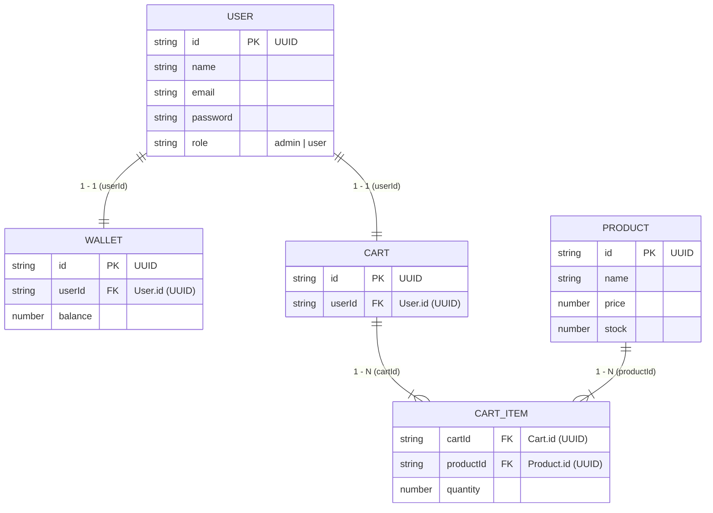

# Mini Store OOP

Dự án mô phỏng hệ thống quản lý bán hàng mini store áp dụng chuẩn các nguyên lý **Lập trình Hướng đối tượng (OOP)** trên nền tảng **Node.js + TypeScript** (chế độ kiểm tra kiểu nghiêm ngặt `strict: true`). Dữ liệu được lưu trữ dạng tệp tin JSON quan hệ (Relational JSON File Storage).

---

## 1. Tính Năng Nổi Bật

- **Mô hình 3 lớp chuẩn OOP (3-Tier Architecture)**: Phân tách rõ ràng giữa Domain Models, Data Repositories và Business Services.
- **Tính đóng gói & Bất biến (Encapsulation & Domain Invariants)**:
  - Thuộc tính nhạy cảm được bảo vệ bằng `private` / `readonly`, thao tác qua getters/setters.
  - Tự động kiểm tra tính hợp lệ dữ liệu (email regex, password tối thiểu 6 ký tự, giá tiền > 0, số lượng nguyên dương, số dư không âm).
- **Tự động sinh khóa chính UUID**: Tất cả các thực thể tự động cấp phát chuỗi UUID v4 ngẫu nhiên (`node:crypto`).
- **Tái tạo đối tượng (Rehydration)**: Dữ liệu đọc từ file JSON được ánh xạ thành class instance thực thụ, đảm bảo gọi được đầy đủ các phương thức OOP.
- **Kiểm soát phân quyền (Role-based Authorization)**: Phân định quyền giữa `admin` (toàn quyền quản trị) và `user` (chỉ xem, chặn thao tác sửa đổi với `403 Forbidden`).
- **Dữ liệu quan hệ sẵn có**: 5 file JSON với 50 bản ghi mẫu cho mỗi file, liên kết khóa ngoại chặt chẽ.

---

## 2. Kiến Trúc & Cấu Trúc Thư Mục

```
mini-store-oop/
├── data/                       # Dữ liệu JSON quan hệ (50 records / file)
│   ├── users.json              # Danh sách tài khoản User (PK: id)
│   ├── wallets.json            # Ví tiền (PK: id, FK: userId -> User.id)
│   ├── products.json           # Danh mục sản phẩm (PK: id)
│   ├── carts.json              # Giỏ hàng (PK: id, FK: userId -> User.id)
│   └── cartitem.json           # Chi tiết mục giỏ hàng (FK: cartId, FK: productId)
├── src/
│   ├── model/                  # Domain Model Entities (OOP Encapsulation & Inheritance)
│   │   ├── base.entity.ts      # Abstract BaseEntity (Kế thừa ID & UUID)
│   │   ├── user.class.ts
│   │   ├── product.class.ts
│   │   ├── wallet.class.ts
│   │   ├── cart.class.ts
│   │   └── cartItem.class.ts
│   ├── interfaces/             # Hợp đồng giao tiếp (Contracts / Abstraction)
│   │   ├── repository.interface.ts
│   │   └── service.interface.ts
│   ├── repositories/           # Tầng truy xuất dữ liệu (Data Access Layer & Rehydration)
│   │   ├── user.repository.ts
│   │   ├── product.repository.ts
│   │   ├── wallet.repository.ts
│   │   ├── cart.repository.ts
│   │   └── cartItem.repository.ts
│   ├── services/               # Tầng nghiệp vụ (Business Logic & Authorization)
│   │   ├── auth.service.ts
│   │   ├── user.service.ts
│   │   ├── product.service.ts
│   │   ├── wallet.service.ts
│   │   └── cart.service.ts
│   └── index.ts                # Application Entry Point
├── AGENTS.md                   # Hướng dẫn quy chuẩn kiến trúc cho AI Agent
├── package.json
├── tsconfig.json
└── README.md
```

---

## 3. Sơ Đồ Quan Hệ Dữ Liệu (ERD)



---

## 4. Công Nghệ Sử Dụng

- **Runtime**: [Node.js](https://nodejs.org/) (v22+)
- **Ngôn ngữ**: [TypeScript](https://www.typescriptlang.org/) (v5+/v7+) với `strict: true`
- **Thực thi Development**: [`tsx`](https://github.com/privatenumber/tsx) (chạy TypeScript tức thì qua esbuild)
- **Chuẩn hóa ID**: `node:crypto` (`randomUUID`)

---

## 5. Hướng Dẫn Cài Đặt & Sử Dụng

### 5.1. Cài đặt Dependencies
```bash
npm install
```

### 5.2. Chạy ứng dụng ở chế độ Development
Thực thi trực tiếp mã TypeScript mà không cần build:
```bash
npm run dev
```

### 5.3. Biên dịch sang JavaScript (Build)
Biên dịch toàn bộ mã nguồn từ `src/` sang thư mục `dist/`:
```bash
npm run build
```

### 5.4. Chạy phiên bản Production
Chạy file JavaScript đã build bằng Node.js:
```bash
npm start
```

---

## 6. Quy Ước Lập Trình (OOP Conventions)

1. **Model**:
   - Chỉ sử dụng 5 Model cốt lõi (`User`, `Product`, `Wallet`, `Cart`, `CartItem`).
   - Mọi thuộc tính thay đổi trạng thái đều phải thông qua getter/setter hoặc domain method có validate.
2. **Repository**:
   - Khi đọc dữ liệu từ JSON (`read`, `readAll`), luôn ánh xạ sang instance class (`new User(...)`, `new Product(...)`, ...).
   - Khi ghi dữ liệu, ghi đè toàn bộ mảng JSON hợp lệ, không dùng `appendFile` chắp vá chuỗi JSON.
3. **Service**:
   - Thao tác tạo/sửa/xóa yêu cầu tham số `role: Role`. Nếu người dùng là `user`, từ chối thao tác và thông báo `403 Forbidden`.
