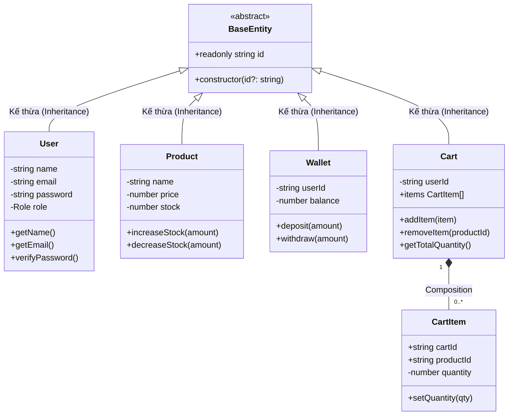
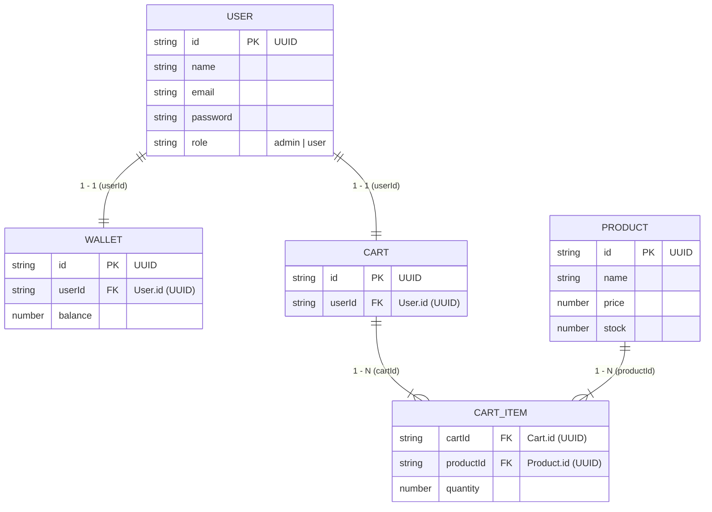

# Mini Store OOP

Dự án mô phỏng hệ thống quản lý bán hàng mini store áp dụng chuẩn các nguyên lý **Lập trình Hướng đối tượng (OOP)** trên nền tảng **Node.js + TypeScript** (chế độ kiểm tra kiểu nghiêm ngặt `strict: true`). Dữ liệu được lưu trữ dạng tệp tin JSON quan hệ (Relational JSON File Storage).

---

## 1. Tính Năng Nổi Bật

- **Mô hình 3 lớp chuẩn OOP (3-Tier Architecture)**: Phân tách rõ ràng giữa Domain Models, Data Repositories và Business Services.
- **Tính đóng gói & Bất biến (Encapsulation & Domain Invariants)**:
  - Thuộc tính nhạy cảm được bảo vệ bằng `private` / `readonly`, thao tác qua getters/setters.
  - Tự động kiểm tra tính hợp lệ dữ liệu (email regex, password tối thiểu 6 ký tự, giá tiền > 0, số lượng nguyên dương, số dư không âm).
- **Tự động sinh khóa chính UUID**: Tất cả các thực thể tự động cấp phát chuỗi UUID v4 ngẫu nhiên (`node:crypto`).
- **Tái tạo đối tượng (Rehydration)**: Dữ liệu đọc từ file JSON được ánh xạ thành class instance thực thụ, đảm bảo gọi được đầy đủ các phương thức OOP.
- **Kiểm soát phân quyền (Role-based Authorization)**: Phân định quyền giữa `admin` (toàn quyền quản trị) và `user` (chỉ xem, chặn thao tác sửa đổi với `403 Forbidden`).
- **Dữ liệu quan hệ sẵn có**: 5 file JSON với 50 bản ghi mẫu cho mỗi file, liên kết khóa ngoại chặt chẽ.

---

## 2. Minh Chứng 4 Tính Chất OOP Trong Dự Án

Dự án áp dụng đầy đủ và chặt chẽ cả 4 trụ cột của **Lập trình Hướng đối tượng (OOP)**:



---

### 2.1. Tính Đóng Gói (Encapsulation)
- **Bản chất**: Che giấu trạng thái dữ liệu nội tại của đối tượng bằng phạm vi truy cập `private`/`readonly`, ngăn chặn can thiệp trái phép từ bên ngoài và bảo đảm tính toàn vẹn (Invariants) thông qua getters/setters và các phương thức miền nghiệp vụ (Domain Methods).
- **Dẫn chứng trong mã nguồn**:
  - [src/model/user.class.ts](file:///d:/saved/Project/mini-store-oop/src/model/user.class.ts): Các trường `name`, `email`, `password`, `role` đều là `private`. Dữ liệu đầu vào bắt buộc đi qua các hàm kiểm tra hợp lệ: `validateName` (không để trống), `validateEmail` (định dạng Regex RFC), `validatePassword` (tối thiểu 6 ký tự), `validateRole` (chỉ nhận `"admin" | "user"`).
  - [src/model/product.class.ts](file:///d:/saved/Project/mini-store-oop/src/model/product.class.ts): Các trường `price` và `stock` là `private`. Trạng thái kho hàng được bảo vệ bởi hai phương thức nghiệp vụ:
    - `increaseStock(amount)`: Kiểm tra `amount` phải là số nguyên dương (> 0).
    - `decreaseStock(amount)`: Ngăn chặn tuyệt đối việc trừ quá số lượng tồn kho hiện có (`stock - amount >= 0`).
  - [src/model/wallet.class.ts](file:///d:/saved/Project/mini-store-oop/src/model/wallet.class.ts): Biến `balance` là `private`. Mọi biến động số dư chỉ được thực hiện thông qua:
    - `deposit(amount)`: Chỉ cho phép nạp số tiền dương.
    - `withdraw(amount)`: Tự động kiểm tra số dư khả dụng (`balance >= amount`), chống số dư âm.
  - [src/model/cart.class.ts](file:///d:/saved/Project/mini-store-oop/src/model/cart.class.ts) & [src/model/cartItem.class.ts](file:///d:/saved/Project/mini-store-oop/src/model/cartItem.class.ts): Quản lý danh sách sản phẩm thông qua `addItem(item)` và `removeItem(productId)` có kiểm tra hợp lệ, không cho phép gán mảng tùy ý.

---

### 2.2. Tính Kế Thừa (Inheritance)
- **Bản chất**: Cho phép các lớp con kế thừa thuộc tính và hành vi chung từ một lớp cha trừu tượng cơ sở, loại bỏ trùng lặp mã nguồn (nguyên lý DRY - Don't Repeat Yourself).
- **Dẫn chứng trong mã nguồn**:
  - **Lớp cha trừu tượng [src/model/base.entity.ts](file:///d:/saved/Project/mini-store-oop/src/model/base.entity.ts)**:
    ```typescript
    import { randomUUID } from "node:crypto";

    export abstract class BaseEntity {
        readonly id: string;

        constructor(id: string = randomUUID()) {
            this.id = (!id || id.trim().length === 0) ? randomUUID() : id;
        }
    }
    ```
    Lớp này đóng gói định danh khóa chính duy nhất `readonly id: string` và cơ chế tự động cấp phát chuỗi UUID v4 ngẫu nhiên.
  - **Các lớp con mở rộng (Extends)**:
    - `User extends BaseEntity` ([src/model/user.class.ts](file:///d:/saved/Project/mini-store-oop/src/model/user.class.ts#L6))
    - `Product extends BaseEntity` ([src/model/product.class.ts](file:///d:/saved/Project/mini-store-oop/src/model/product.class.ts#L4))
    - `Wallet extends BaseEntity` ([src/model/wallet.class.ts](file:///d:/saved/Project/mini-store-oop/src/model/wallet.class.ts#L4))
    - `Cart extends BaseEntity` ([src/model/cart.class.ts](file:///d:/saved/Project/mini-store-oop/src/model/cart.class.ts#L5))
  - Cả 4 thực thể đều gọi `super(id)` trong constructor, tự động thừa hưởng cơ chế khởi tạo và kiểm tra ID duy nhất mà không cần viết lại mã nguồn.

---

### 2.3. Tính Trừu Tượng (Abstraction)
- **Bản chất**: Ẩn giấu các chi tiết kỹ thuật phức tạp (như thao tác đọc/ghi file hệ thống JSON, phân giải đường dẫn, xử lý bất đồng bộ I/O) và chỉ phơi bày giao diện (Contract/Interface) với các hành vi cốt lõi.
- **Dẫn chứng trong mã nguồn**:
  - **Abstract Class [BaseEntity](file:///d:/saved/Project/mini-store-oop/src/model/base.entity.ts)**: Không thể khởi tạo trực tiếp bằng từ khóa `new BaseEntity()`, định nghĩa trừu tượng hóa cho toàn bộ thực thể có khóa chính.
  - **Interface Kho Dữ Liệu [src/interfaces/repository.interface.ts](file:///d:/saved/Project/mini-store-oop/src/interfaces/repository.interface.ts)**:
    ```typescript
    export interface IRepository<T> {
        create(item: T): Promise<T>;
        readAll(): Promise<T[]>;
        read(id: string): Promise<T | null>;
        update(id: string, item: Partial<T>): Promise<T | null>;
        delete(id: string): Promise<boolean>;
    }
    ```
    Định nghĩa hợp đồng CRUD chuẩn. Tầng Service chỉ cần giao tiếp thông qua hợp đồng `IRepository<T>` mà không cần phụ thuộc vào việc dữ liệu được lưu bằng file JSON, SQLite hay MongoDB.
  - **Interface Dịch Vụ Nghiệp Vụ [src/interfaces/service.interface.ts](file:///d:/saved/Project/mini-store-oop/src/interfaces/service.interface.ts)**:
    Tách biệt thành `IMustBePublic<T>` (các phương thức đọc công khai) và `IMustAuthorization<T>` (các phương thức bắt buộc xác thực quyền quản trị).

---

### 2.4. Tính Đa Hình (Polymorphism)
- **Bản chất**: Cho phép các đối tượng hoặc lớp khác nhau phản hồi cùng một lời gọi phương thức hoặc giao diện chung theo những cách thức riêng biệt (Subtype Polymorphism, Parametric Polymorphism / Generics).
- **Dẫn chứng trong mã nguồn**:
  - **Đa hình kiểu con (Subtype Polymorphism qua Interface)**:
    - Cả `UserRepository`, `ProductRepository`, `WalletRepository`, `CartRepository` đều cài đặt giao diện `IRepository<T>`.
    - Khi gọi `read(id)`, mỗi repository có cách xử lý đa hình đặc thù:
      - [UserRepository.read](file:///d:/saved/Project/mini-store-oop/src/repositories/user.repository.ts): Đọc và chuyển hóa plain JSON object thành thực thể `User`.
      - [CartRepository.read](file:///d:/saved/Project/mini-store-oop/src/repositories/cart.repository.ts): Ngoài việc đọc giỏ hàng `Cart`, nó còn tự động truy vấn thêm các `CartItem` tương ứng từ `CartItemRepository` để nạp đầy đủ danh sách món hàng vào giỏ (Aggregate Rehydration).
  - **Đa hình tham số hóa (Generics Polymorphism)**:
    - Các interface `IRepository<T>` và `IService<T>` hoạt động đa hình trên nhiều kiểu thực thể khác nhau (`T = User`, `Product`, `Wallet`, `Cart`) mà vẫn đảm bảo tính an toàn kiểu tại thời điểm biên dịch (Type-Safe).
  - **Mô hình Rich Domain Model thay vì Anemic Domain Model**:
    - Thay vì viết mã thủ tục bên ngoài Service để tính toán dữ liệu, các hành vi nghiệp vụ được kích hoạt trực tiếp từ bản thân đối tượng (`wallet.withdraw(...)`, `product.decreaseStock(...)`, `cart.addItem(...)`), sau đó Service mới nhận đối tượng đã cập nhật để lưu trữ.

---

## 3. Kiến Trúc & Cấu Trúc Thư Mục

```
mini-store-oop/
├── data/                       # Dữ liệu JSON quan hệ (50 records / file)
│   ├── users.json              # Danh sách tài khoản User (PK: id)
│   ├── wallets.json            # Ví tiền (PK: id, FK: userId -> User.id)
│   ├── products.json           # Danh mục sản phẩm (PK: id)
│   ├── carts.json              # Giỏ hàng (PK: id, FK: userId -> User.id)
│   └── cartitem.json           # Chi tiết mục giỏ hàng (FK: cartId, FK: productId)
├── src/
│   ├── model/                  # Domain Model Entities (OOP Encapsulation & Inheritance)
│   │   ├── base.entity.ts      # Abstract BaseEntity (Kế thừa ID & UUID)
│   │   ├── user.class.ts
│   │   ├── product.class.ts
│   │   ├── wallet.class.ts
│   │   ├── cart.class.ts
│   │   └── cartItem.class.ts
│   ├── interfaces/             # Hợp đồng giao tiếp (Contracts / Abstraction)
│   │   ├── repository.interface.ts
│   │   └── service.interface.ts
│   ├── repositories/           # Tầng truy xuất dữ liệu (Data Access Layer & Rehydration)
│   │   ├── user.repository.ts
│   │   ├── product.repository.ts
│   │   ├── wallet.repository.ts
│   │   ├── cart.repository.ts
│   │   └── cartItem.repository.ts
│   ├── services/               # Tầng nghiệp vụ (Business Logic & Authorization)
│   │   ├── auth.service.ts
│   │   ├── user.service.ts
│   │   ├── product.service.ts
│   │   ├── wallet.service.ts
│   │   └── cart.service.ts
│   └── index.ts                # Application Entry Point
├── AGENTS.md                   # Hướng dẫn quy chuẩn kiến trúc cho AI Agent
├── package.json
├── tsconfig.json
└── README.md
```

---

## 4. Sơ Đồ Quan Hệ Dữ Liệu (ERD)



---

## 5. Công Nghệ Sử Dụng

- **Runtime**: [Node.js](https://nodejs.org/) (v22+)
- **Ngôn ngữ**: [TypeScript](https://www.typescriptlang.org/) (v5+/v7+) với `strict: true`
- **Thực thi Development**: [`tsx`](https://github.com/privatenumber/tsx) (chạy TypeScript tức thì qua esbuild)
- **Chuẩn hóa ID**: `node:crypto` (`randomUUID`)

---

## 6. Hướng Dẫn Cài Đặt & Sử Dụng

### 6.1. Cài đặt Dependencies
```bash
npm install
```

### 6.2. Chạy ứng dụng ở chế độ Development (Console CLI)
Thực thi trực tiếp mã TypeScript mà không cần build:
```bash
npm run dev
```

### 6.3. Biên dịch sang JavaScript (Build)
Biên dịch toàn bộ mã nguồn từ `src/` sang thư mục `dist/`:
```bash
npm run build
```

### 6.4. Chạy phiên bản Production
Chạy file JavaScript đã build bằng Node.js:
```bash
npm start
```

---

## 7. Tài Khoản Thử Nghiệm

Hệ thống có sẵn 50 tài khoản người dùng được sinh sẵn trong `data/users.json`:

| Vai Trò (Role) | Email Đăng Nhập | Mật Khẩu | Quyền Hạn |
| :--- | :--- | :--- | :--- |
| **Admin** | `user1@ministore.com` | `password1` | Quản trị toàn bộ: Xem/Tạo/Sửa/Xóa User, Product, xem Wallet, Cart |
| **User (Khách)** | `user6@ministore.com` | `password6` | Xem sản phẩm, Nạp tiền ví, Thêm giỏ hàng, Thanh toán (Checkout) |

---

## 8. Quy Ước Lập Trình (OOP Conventions)

1. **Model**:
   - Kế thừa lớp trừu tượng `BaseEntity` cho mọi thực thể có ID.
   - Chỉ sử dụng 5 Model cốt lõi (`User`, `Product`, `Wallet`, `Cart`, `CartItem`).
   - Mọi thuộc tính thay đổi trạng thái đều phải thông qua getter/setter hoặc domain method có validate.
2. **Repository**:
   - Khi đọc dữ liệu từ JSON (`read`, `readAll`), luôn ánh xạ sang instance class (`new User(...)`, `new Product(...)`, ...).
   - Khi ghi dữ liệu, ghi đè toàn bộ mảng JSON hợp lệ, không dùng `appendFile` chắp vá chuỗi JSON.
3. **Service**:
   - Thao tác tạo/sửa/xóa yêu cầu tham số `role: Role`. Nếu người dùng là `user`, từ chối thao tác và thông báo `403 Forbidden`.

